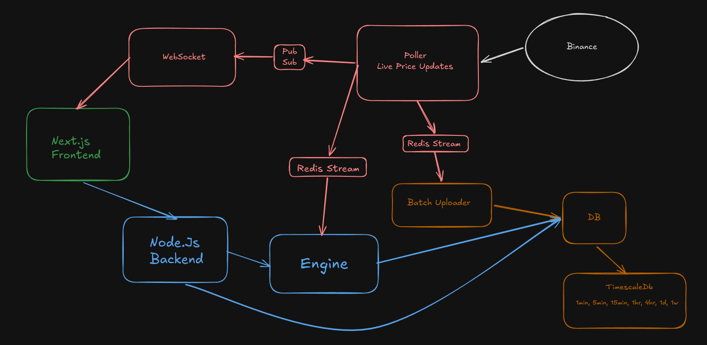

# 📈 CFD Trading App

An Exness-inspired CFD (Contract for Difference) trading platform built with modern web technologies.  
This project simulates real-time price updates, interactive charts, and trading functionality.

---

## 🚀 Features

- 📊 Real-time price updates
- 📉 Interactive trading charts
- ⏱️ Multiple timeframe selection
- 💱 Multi-asset support (BTC / SOL / etc.)
- 🧾 Order placement (Buy / Sell)
- 🔐 Authentication
- ⚡ Fast & responsive UI

---

## Architecture



---

## 🛠️ Tech Stack

**Frontend**
- Next.js / React
- TypeScript
- TailwindCSS

**Backend**
- Node.js / Next.js API / Express
- WebSockets (for live prices)
- Prisma / PostgreSQL
- Redis 


---

## ⚙️ Installation

### 1️⃣ Clone the repository

```bash
git clone https://github.com/anandrajsingh/cfd.git
cd cfd